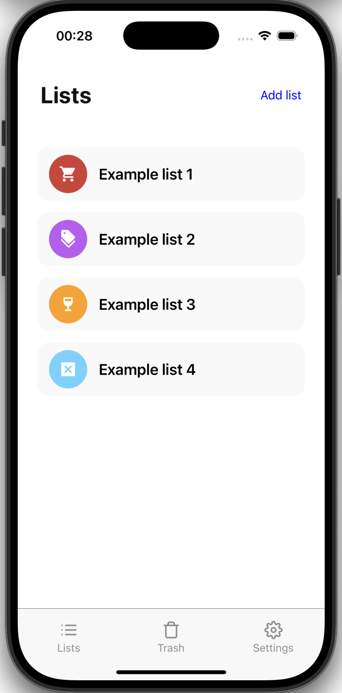
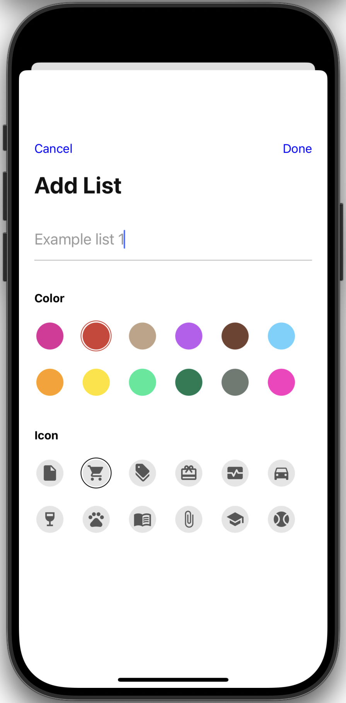

# BuyAlly

## Overview
BuyAlly is a mobile application designed for creating and managing shopping lists. The project is currently in its early development stages and is a work in progress. It is built using the React Native library and the Expo framework.

## Screenshots
| Main Screen | Add List Modal |
| :---: | :---: |
|  |  |

## Features
* **List Management**: Users can create multiple shopping lists with custom titles.
* **Visual Customization**: Each list can be assigned a specific color and icon from a predefined set for better organization.
* **Centralized State**: The application uses a central store to manage list data and user inputs.
* **Navigation**: Implementation of file-based routing with support for modal presentations.

## Tech Stack
* **Framework**: Expo SDK 54.
* **Core Library**: React Native 0.81.
* **Routing**: Expo Router.
* **State Management**: Zustand.
* **Language**: TypeScript.
* **Icons**: Expo Vector Icons.

## Getting Started

### Prerequisites
Ensure you have Node.js and the Expo Go app (or an emulator) installed on your system.

### Installation
1. Clone the repository to your local machine.
2. Navigate to the project directory and install the necessary dependencies:
   ```bash
   npm install
   ```
3. Start the development server using Expo:
  ```bash
   npx expo start
  ```

## Project Status
Early stage development. Core data structures and navigation flows are implemented. Future updates will focus on persistent storage and enhanced list functionalities.
